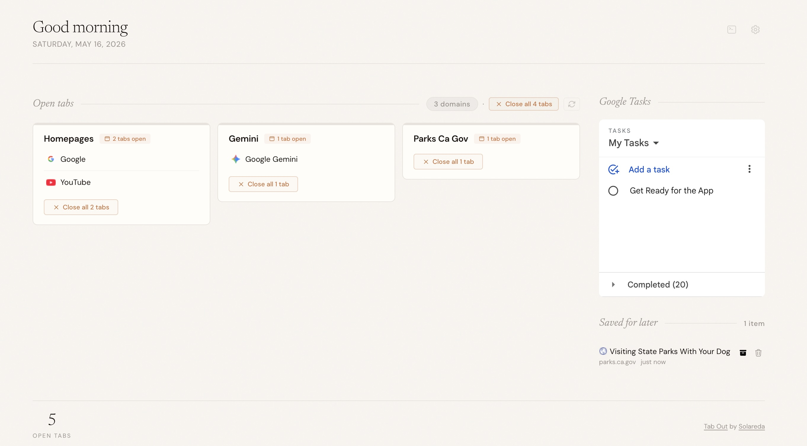

# Tab Out

**Keep tabs on your tabs.**

Tab Out is a minimalist Chrome extension that replaces your new tab page with a beautiful dashboard of everything you have open. Tabs are intelligently grouped by domain, with landing pages like Gmail and GitHub pulled into their own group. Close tabs with a satisfying swoosh + confetti burst.

No server. No account. No external API calls. Just a Chrome extension.



---

## ✨ Features You'll Love

- **📦 Tab Grouping** — Group your tabs by **domain name or window** for instant clarity.
- **🏷️ Native Support** — Fully recognizes and respects your existing **Chrome Tab Groups**.
- **✅ Built-in Google Tasks** — Manage your to-dos directly from your dashboard—no context switching.
- **🏠 Home Base** — Gmail, X, LinkedIn, and YouTube homepages are automatically grouped into a clean "Home" card.
- **🧹 Close with Style** — Close tabs with a satisfying **swoosh + confetti** burst.
- **👯 Duplicate Detection** — Spot and close duplicate tabs with a single click.
- **💾 Save for Later** — Bookmark individual tabs to a local checklist before closing them.
- **🛠️ Power Tools** — Includes a **Refresh** button to update tabs instantly and a **Debug Mode** for domain tracking.
- **🔒 100% Local** — Your data never leaves your machine. No accounts, no servers, no tracking.

---

## ⚡ Quick Install

**1. Clone the repo**

```bash
git clone https://github.com/ziikki/tab-out.git
```

**2. Load the Chrome extension**

1. Open Chrome and go to `chrome://extensions`
2. Enable **Developer mode** (top-right toggle)
3. Click **Load unpacked**
4. Navigate to the `extension/` folder inside the cloned repo and select it

**3. Open a new tab**

You'll see Tab Out.

---

## How it works

```
You open a new tab
  -> Tab Out shows your open tabs grouped by domain
  -> Homepages (Gmail, X, etc.) get their own group at the top
  -> Click any tab title to jump to it
  -> Close groups you're done with (swoosh + confetti)
  -> Save tabs for later before closing them
```

Everything runs inside the Chrome extension. No external server, no API calls, no data sent anywhere. Saved tabs are stored in `chrome.storage.local`.

---

## Tech stack

| What | How |
|------|-----|
| Extension | Chrome Manifest V3 |
| Storage | chrome.storage.local |
| Sound | Web Audio API (synthesized, no files) |
| Animations | CSS transitions + JS confetti particles |

---

## License

MIT — see [LICENSE](LICENSE)

---

Originally built by [Zara Zhang](https://x.com/zarazhangrui). Forked by [Solareda](https://github.com/ziikki).
